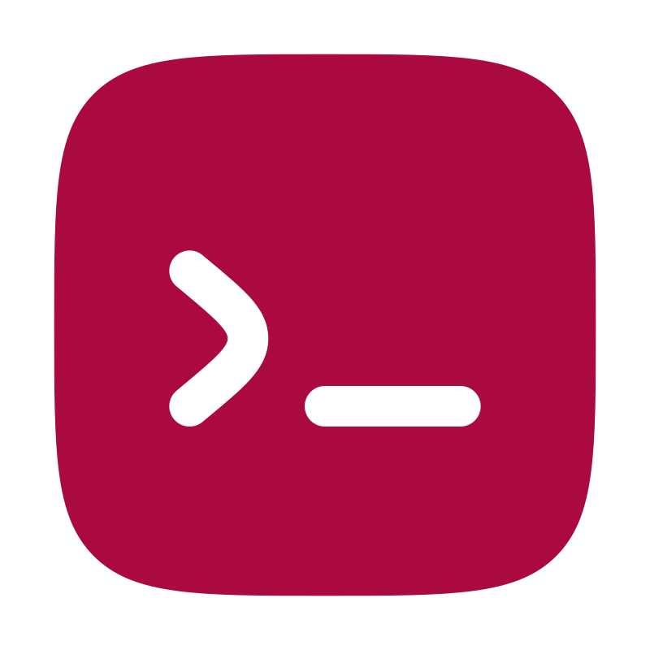
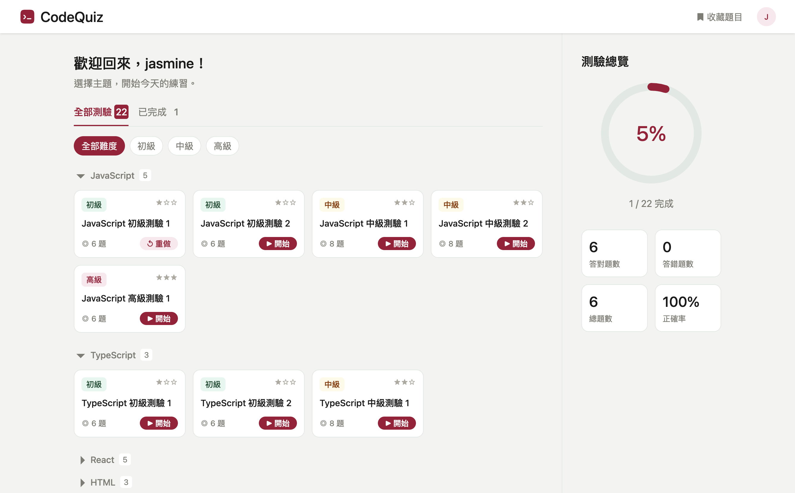
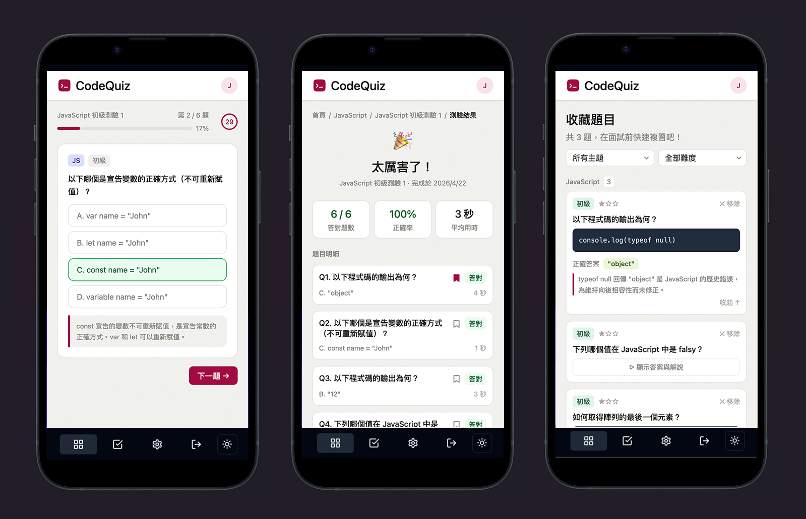
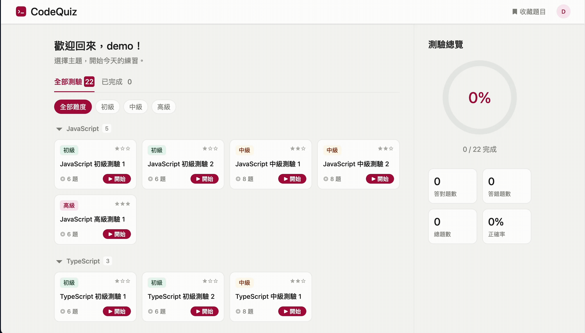
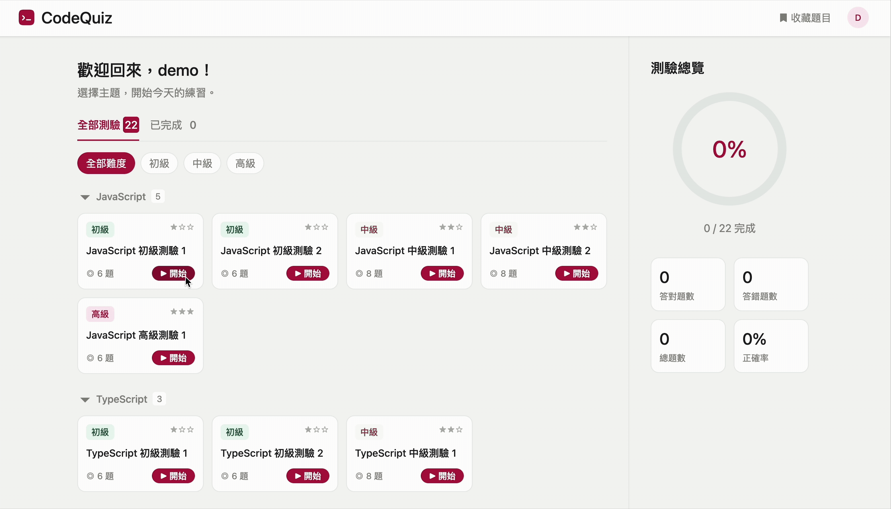
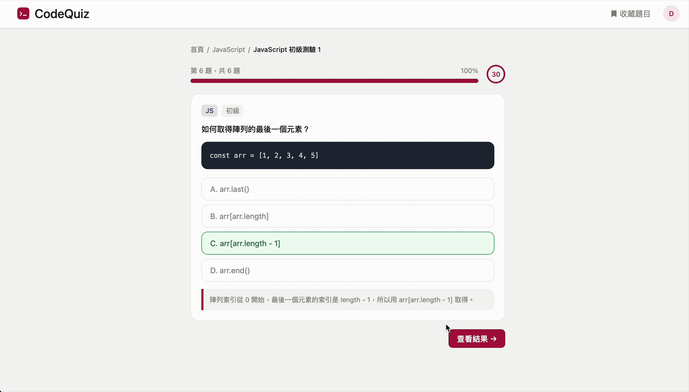
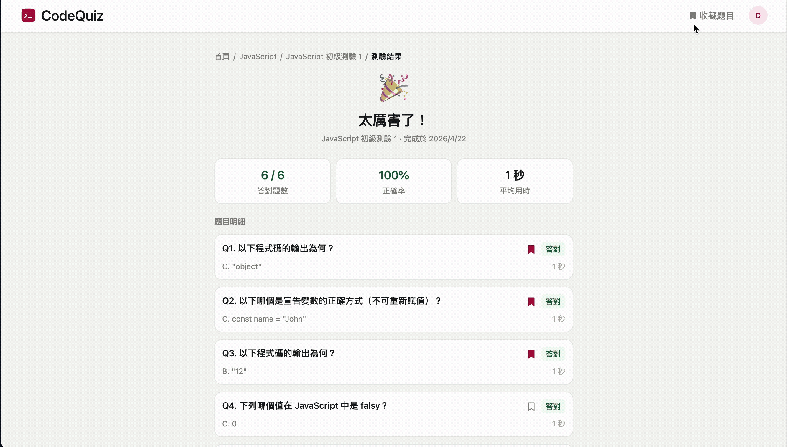

<div align="center">
  

### CodeQuiz｜程式題庫測驗平台

</div>

> 專為軟體工程師打造的面試準備工具，目前涵蓋前端 JavaScript、TypeScript、React、HTML、CSS、瀏覽器原理共 6 大主題測驗題庫。

## 📜 目錄

<details>
<summary>展開目錄</summary>

- [👀 線上體驗](#-線上體驗)
- [💡 專案介紹](#-專案介紹)
- [✨ 功能介紹](#-功能介紹)
- [🛠 技術棧](#-技術棧)
- [🏗 架構設計](#-架構設計)
- [🤔 未來規劃](#-未來規劃)
- [ 📝 學習心得](#-學習心得)
- [🚀 本地執行](#-本地執行)

</details>

## 👀 線上體驗: [developer-code-quiz.vercel.app](https://developer-code-quiz.vercel.app)

測試帳號：`demo` / 密碼：`1234`





## 💡 專案介紹

CodeQuiz 是一個針對軟體工程師設計的測驗練習平台，幫助開發者在面試前系統性地複習相關知識。每道題目附有詳細解說，答錯的題目可以收藏，方便面試前快速複習。

## ✨ 功能介紹

**首頁：選擇主題與難度，開始測驗**

目前支援前端 6 大主題（JavaScript、TypeScript、React、HTML、CSS、瀏覽器）、三種難度篩選，依主題分組顯示，點擊主題標題可收合展開。




**測驗頁：計時作答，即時顯示解說**

每題 30 秒倒數，計時器剩餘 10 秒變色提醒，作答後立即顯示對錯與詳細解說。




**測驗結果頁：分析作答情況，收藏題目**

顯示答對題數、正確率、平均用時，針對不熟悉的題目可一鍵收藏。




**收藏頁：面試前快速複習**

依主題分組、依難度排序，支援篩選，點擊「顯示答案與解說」才展開，方便自我測試。




### 其他功能

- 帳號系統：本地註冊、登入，支援清除測驗紀錄、刪除帳號
- 已登入狀態：首頁提供測驗列表的 Tab（全部／已完成）篩選，並顯示個人統計側欄（完成進度圓形圖、答題統計）
- 未登入狀態：點擊測驗後登入，自動導向該測驗頁
- 首頁 Tab 和難度篩選狀態持久化於 URL，重新整理後恢復
- 全站 RWD，支援手機、平板、桌機，根據不同裝置調整 UI

## 🛠 技術棧

| 類別 | 技術 |
|------|------|
| 框架 | [React 18](https://react.dev) + [TypeScript](https://www.typescriptlang.org) |
| 建構工具 | [Vite](https://vitejs.dev) |
| 樣式 | [Tailwind CSS v4](https://tailwindcss.com) |
| 路由 | [React Router v6](https://reactrouter.com) |
| 表單 | [React Hook Form](https://react-hook-form.com) |
| 狀態管理 | React Context |
| 資料儲存 | localStorage |
| 部署 | [Vercel](https://vercel.com) |

## 🏗 架構設計

### Feature-based 資料夾結構

```
src/
├── views/                    # Feature-based 頁面
│   ├── Home/                 # 首頁
│   │   ├── HomePage.tsx      # 畫面層
│   │   ├── controller.ts     # 邏輯層（Custom Hook）
│   │   ├── constant.ts       # 常數（固定不變的資料）
│   │   ├── index.ts          # 統一匯出入口
│   │   └── components/       # 頁面專屬元件
│   ├── Auth/                 # 登入／註冊頁
│   ├── Quiz/                 # 測驗頁
│   ├── Result/               # 結果頁
│   └── Bookmarks/            # 收藏頁
├── components/
│   ├── ui/                   # 共用 UI 元件（Breadcrumb、ConfirmModal、Loading）
│   └── container/            # 佈局元件（LayoutContainer，含 Navbar）
├── context/                  # 全域狀態（AuthContext）
├── services/                 # 資料存取層（authService）
├── hooks/                    # 共用 Custom Hooks（useDropdown）
├── types/                    # 共用型別（QuestionResult、QuizRecord）
├── utils/                    # 共用工具函式（storage）
├── router/                   # 路由設定
├── style/                    # 全域樣式
└── data/                     # 題庫資料
```

### 畫面與邏輯分離

每個頁面拆分為畫面層（`XxxPage.tsx`）和邏輯層（`controller.ts`）：

```ts
// HomePage.tsx 只負責渲染，不處理資料
const { topics, groupedQuizzes, isCompleted, handleStartQuiz } = useController()
```

### 關鍵架構決策

**1. Context 設計**

將全域狀態集中在 `AuthContext` 統一管理：

```
AuthContext  → 登入狀態、使用者資訊、統計資料、初始化載入（initLoading）
```

**2. URL 狀態持久化**

首頁的 Tab 和難度篩選存於 URL Query String，重新整理後狀態正確恢復：

```
/home?tab=completed&difficulty=medium
```

**3. 防閃爍策略**

重新整理時的閃爍問題分兩層處理：

- **全域層**：`LayoutContainer` 透過 `AuthContext` 的 `isInitialized` 判斷，初始化完成前顯示 Loading，避免登入狀態尚未讀取時短暫閃現未登入畫面。
- **頁面層**：各頁面自行管理 `isLoading` 狀態，資料讀取完成前不渲染內容，避免空狀態短暫閃現。

**4. 資料存取層統一管理**

所有 localStorage 操作集中在 `authService`，頁面邏輯不直接操作 localStorage：

```ts
authService.getQuizRecords(username)
authService.saveQuizRecord(username, record)
```

## 🤔 未來規劃

目標將 CodeQuiz 擴展為適合所有軟體工程師的面試準備平台。

**測驗體驗**
- [ ] 深色模式切換
- [ ] 錯題本測驗模式：直接對收藏題目重新作答
- [ ] Live Coding 練習模式：模擬面試時的程式撰寫情境

**題庫客製化**
- [ ] 管理後台：動態新增與編輯題目
- [ ] 題目匯入：支援使用者自行匯入自訂題庫

**技術提升**
- [ ] 學習後端開發，串接自製 API
- [ ] 將資料從 localStorage 遷移至資料庫

##  📝 學習心得

這是為了讓在面試階段的我能隨時複習技術知識而生的作品（笑），也是我第一個完整使用 **TypeScript** 開發的前端專案。

在此之前，我曾與資深工程師協作開發商用 ERP 系統（React.js + JavaScript），從中學習到許多工程思維——包含畫面與邏輯分離、Feature-based 資料夾結構、工具及元件的重用性與擴充性設計等。
CodeQuiz 是我將這些思維完整實踐的載體，同時補足了 TypeScript 的實戰經驗。

### TypeScript 的收穫

- 用 `interface` 定義資料結構（`Quiz`、`Question`、`QuizRecord` 等），讓每層資料的形狀清晰可預期
- 用 `type` 定義聯集型別（`Topic`、`Difficulty`、`TabType`），限縮變數的合法值範圍
- 透過泛型讓函式和型別保持彈性，例如 `useState<string[]>`、`Record<string, Quiz[]>`
- 學會用 `flatMap` 同時處理型別轉換與空值過濾，避免 `map + filter` 造成 `(T | null)[]` 的型別問題
- 了解型別系統在資料複雜的專案中防止錯誤的價值

## 🚀 本地執行

```bash
# 複製專案
git clone https://github.com/jasminelin921/codequiz.git
cd codequiz

# 安裝依賴
npm install

# 啟動開發伺服器
npm run dev
```

### 測試帳號

測試帳號：`demo` / 密碼：`1234`
或自行註冊新帳號。

## 🔒 授權聲明

本專案僅供學習參考與個人作品集展示，未提供任何開源授權。
未經授權，請勿將本專案的程式碼或設計用於商業用途。